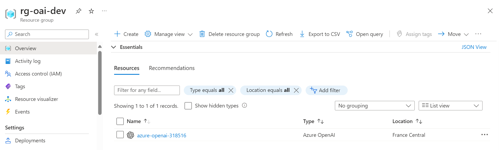
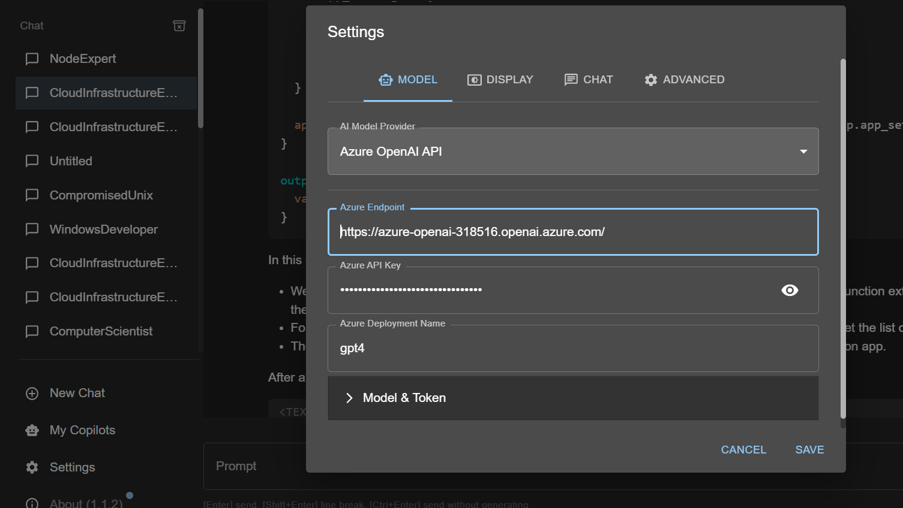
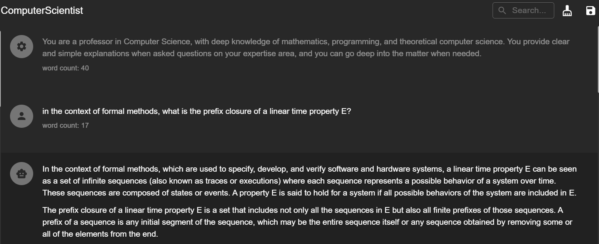

Lately, some friends have asked me to cooperate on a scientific paper regarding LLMs. As part of this collaboration, I had to assess the feasibility of the automatic deployment of an LLM on a public cloud. 

I'm lucky enough to work at a company focusing on AI and Microsoft-oriented system integration, and we're always looking for new ways to bring value to the market using cutting-edge services. For this reason, I've been tinkering with the AzureOpenAi Service for a while: it offers business users the possibility to leverage the power of OpenAi's most advanced models, such as GPT-4 Turbo, without sharing confidential organization data with third parties.

In the last year, I've used OpenTofu/Terraform daily to provision our infrastructure. I've really come to appreciate the advantages of Infrastructure as Code, some of which are:

- Eliminating error-prone manual operations
- Easy reproducibility of configurations for different clients

Explaining the capabilities of such a tool in a few paragraphs is nearly impossible, but these are some reasons why I chose it over other deployment methods. 

Combining business with pleasure, I tried to find the best way to automatize the deployment of AzureOpenAi services using OpenTofu/Terraform. The following is a brief recount of what I did.

#### Prerequisites

Before trying any of the following:

- Obtain an Azure subscription with [access to AzureOpenAi](https://learn.microsoft.com/en-us/legal/cognitive-services/openai/limited-access#registration-process)
- Download [OpenTofu](https://opentofu.org/)(or Terraform) and be sure to know how to authenticate to your Azure subscription using one of the methods listed on top of [this](https://registry.terraform.io/providers/hashicorp/azurerm/latest/docs/guides/azure_cli) page  
- Download [Chatbox](https://github.com/Bin-Huang/chatbox/tree/main) or any other LLM frontend to test the deployed model (optional)

From now on, I also assume you have some basic understanding of Azure, IaC, and LLMs, at least on a surface level.

> 💡 **Why OpenTofu?** Some months back, Hashicorp changed the license of Terraform to the BUSL. Their action was very controversial. That encouraged many organizations to reconsider their usage of the tool.I'm interested in supporting open-source and free software when having a choice: that's why I'm using OpenTofu. The examples in this article are compatible with Terraform nonetheless.

### Choosing the right way

I've already been experimenting with AzureOpenAi for a while. Moreover, I'm using Terraform daily at work, so the first thing I did was look at the docs of the Azure Terraform provider. I found there is a [resource to deploy Cognitive Services](https://registry.terraform.io/providers/hashicorp/azurerm/latest/docs/resources/cognitive_deployment) in it but no direct way to deploy the AzureOpenAi Service itself.

Being lazy, I didn't want to write all the configurations myself. I instantly hit Google and quickly found [this](https://github.com/Azure/terraform-azurerm-openai/tree/main) neat module, [backed](https://www.hashicorp.com/blog/accelerating-ai-adoption-on-azure-with-terraform) by Microsoft and Hashicorp and developed by community contributors. At the moment, this seems like the fastest way to deploy an OpenAi model on Azure. 

The module is not well known: when writing this article, on Feb 14th, 2024, the [public registry](https://registry.terraform.io/modules/Azure/openai/azurerm/0.1.3) showed only 6.4k downloads since May 2023, when it was first published, so I tried it and wrote the following OpenTofu code to check the module's maturity and usability.

Please be aware that the following examples have been run in a local environment, so this code is not ready for production deployment.

```terraform
// everything in a single file for brevity

terraform {
  required_providers {
    azurerm = {
      source  = "hashicorp/azurerm"
      version = "~>3.80.0" // most recent version supported by the module
    }

    // required by the module
    modtm = {
      source  = "Azure/modtm"
      version = ">= 0.1.8, < 1.0"
    }
  }
}

provider "azurerm" {
  features {}
}

provider "modtm" {
  enabled = false
}

// be sure to select a location where AzureOpenAi
// and the model/model version are supported
resource "azurerm_resource_group" "openai_deployment_test" {
  name     = "rg-oai-dev"
  location = "France Central"
}

module "openai" {
  source                        = "Azure/openai/azurerm"
  version                       = "0.1.3"
  resource_group_name           = azurerm_resource_group.openai_deployment_test.name
  location                      = azurerm_resource_group.openai_deployment_test.location
  public_network_access_enabled = true
  deployment = {
    "gpt-4-turbo" = {
      name          = "gpt-4"
      model_format  = "OpenAI"
      model_name    = "gpt-4"
      model_version = "1106-Preview"
      scale_type    = "Standard"
      capacity      = 10 // rate limited to 10k tokens per minute
    },
  }
  depends_on = [
    azurerm_resource_group.openai_deployment_test
  ]
}

// outputs added for next step convenience
output "endpoint" {
    value = module.openai.openai_endpoint  
}

output "primary_key" {
    value = module.openai.primary_key     
}
```

I assume you are already authenticated to your Azure subscription (perhaps using the Azure CLI as suggested in the Azure provider documentation). 

After running a ```tofu init``` and a ```tofu plan```, everything looks fine: the IaC tool wants to create the resources needed to make our deployment work.

```bash
OpenTofu will perform the following actions:

  # azurerm_resource_group.openai_deployment_test will be created
  + resource "azurerm_resource_group" "openai_deployment_test" {
      + id       = (known after apply)
      + location = "francecentral"
      + name     = "rg-oai-dev"
    }

  # module.openai.data.azurerm_resource_group.this will be read during apply
  # (depends on a resource or a module with changes pending)
 <= data "azurerm_resource_group" "this" {
      + id         = (known after apply)
      + location   = (known after apply)
...
(omitted for brevity)
...

Plan: 5 to add, 0 to change, 0 to destroy.

Changes to Outputs:
  + endpoint    = (known after apply)
  + primary_key = (sensitive value)
```

After proceeding with ```tofu apply``` and witnessing success, we can check if the resources have been provisioned correctly on our subscription.



It seems everything worked correctly. Azure OpenAI Service generates a public endpoint and a primary key that we can use together to test our deployment.

### Testing the deployment

Chatbox is a neat desktop client that supports various LLMs. I'm assuming you've downloaded and installed it in the following steps.

First, we need to retrieve our deployment's endpoint and primary key: we can do so by using tofu output, having defined proper output blocks in the infrastructure code above.

```bash
➜  test-openai-automatic-provisioning tofu output endpoint
"https://azure-openai-318516.openai.azure.com/"
➜  test-openai-automatic-provisioning tofu output primary_key
"853bb4c221754e158f431d5591bf3a6c"
```

Be sure that the endpoint and the key will be long gone by the time I publish this!

We open the app and configure our deployment by going to the Settings tab. Check the "Model & Token" subsection if you want to manage model temperature and max generated tokens.



And that's it! You can now use Chatbox (maybe with a nice Persona prompting pattern) to test your deployment. It also supports some neat features such as export to Markdown, if you need them.



### Security

The module also supports some enterprise-grade security measures. Notably, it features, among other things, Private Endpoint and Access Control List integrations. 

These security features go beyond the proposed scope of this technical article. Even then, an architect should consider them when developing a secure enterprise-grade solution for customers demanding extra safety over their deployments.

### Conclusions

In this small technical article, I tried to show how to provision an "AzureOpenAi Service" resource by using a widely adopted IaC tool such as OpenTofu/Terraform. The agility of such tools makes it extremely simple and fast to bring value to the customers, and, together with DevOps practices, helps developers and architects focus on solving real problems.

Some next steps could be trying to automate the fine-tuning of the model or automatically benchmarking the deployment against a set of client-business-related tasks. I might try to do some of that in a future blog post. 

Thanks for coming this far. Power to the nerds!

### References

[Accelerating AI adoption on Azure with Terraform (hashicorp.com)](https://www.hashicorp.com/blog/accelerating-ai-adoption-on-azure-with-terraform)

[GitHub - Azure/terraform-azurerm-openai: Terraform module for deploying Azure OpenAI Service.](https://github.com/Azure/terraform-azurerm-openai/tree/main)

[OpenTofu](https://opentofu.org/)

[Limited access to Azure OpenAI Service - Azure AI services | Microsoft Learn](https://learn.microsoft.com/en-us/legal/cognitive-services/openai/limited-access)

[Azure Provider: Authenticating via the Azure CLI | Guides | hashicorp/azurerm | Terraform | Terraform Registry](https://registry.terraform.io/providers/hashicorp/azurerm/latest/docs/guides/azure_cli)

[GitHub - Bin-Huang/chatbox: Chatbox is a desktop client for ChatGPT, Claude and other LLMs, available on Windows, Mac, Linux](https://github.com/Bin-Huang/chatbox/tree/main)

[azurerm_cognitive_deployment | Resources | hashicorp/azurerm | Terraform | Terraform Registry](https://registry.terraform.io/providers/hashicorp/azurerm/latest/docs/resources/cognitive_deployment)