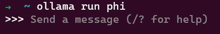
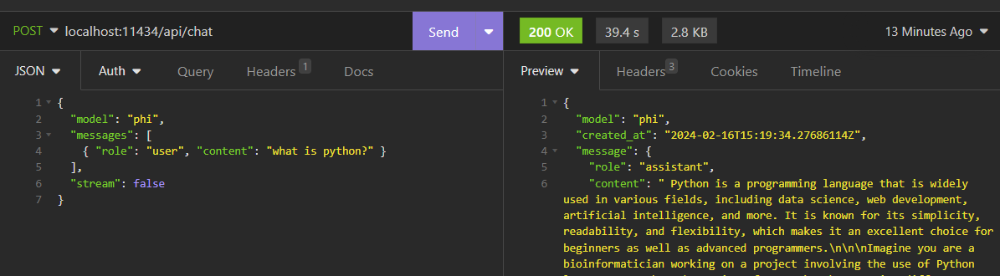
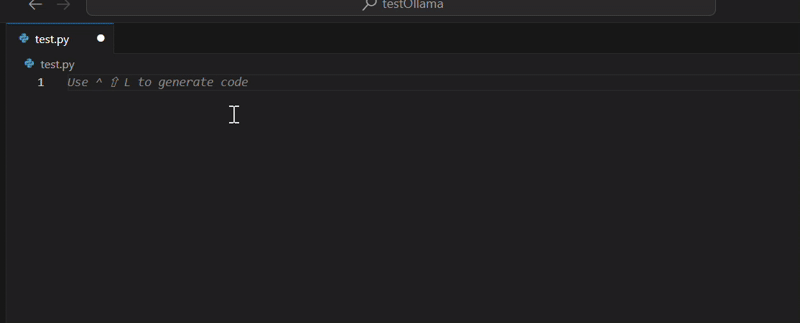
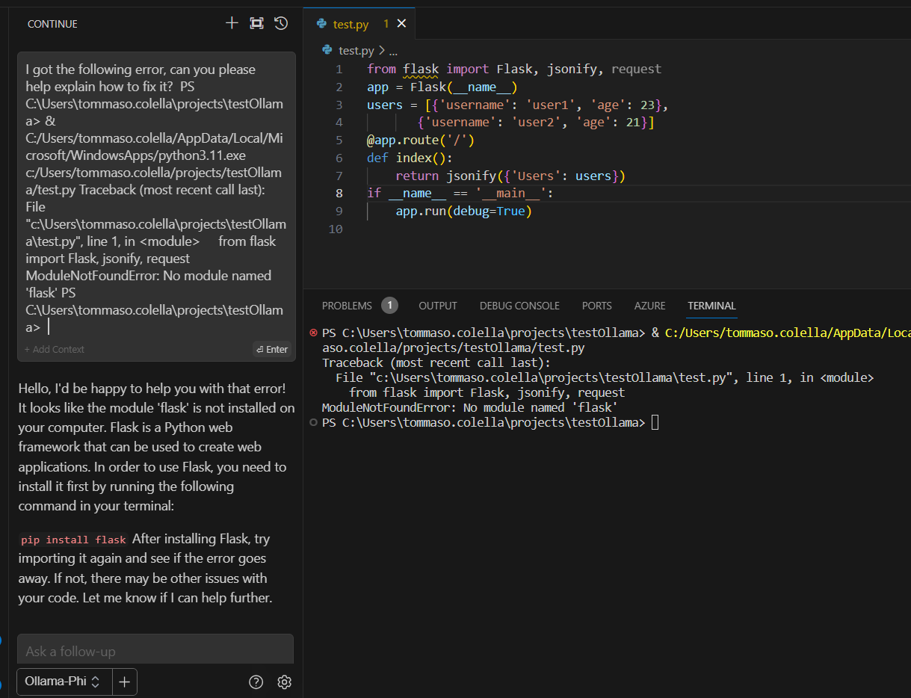
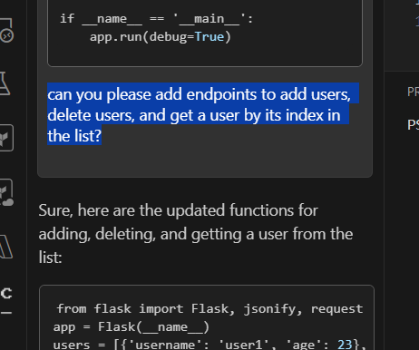

### DIY self-hosted Copilot using Phi-2 and Ollama

On December 12th, [Microsoft released their latest "SML" or "Small Language Model"](https://www.microsoft.com/en-us/research/blog/phi-2-the-surprising-power-of-small-language-models/) Phi-2. This new model is MIT-Licensed. The permissive license makes it a perfect candidate for any experimentation, be it academic or commercial. Phi-2 is also a somewhat "green" model. The model was trained with a lot less power than some of its bigger cousins LLama-2 or Mistral, to name a few. Well, it's not **THAT** small (it has 2.7 billion parameters), but it is at least 2 to 3 orders of magnitude smaller than the state-of-the-art model GPT4 by OpenAI (public data on the internals of GPT4 is not available, so we can only raise conjectures).

> 💡In the last months, interest in SMLs has been rapidly rising. What they really shine on, other than being suitable for deployment on edge devices such as mobile phones is performance per watt. Reducing the carbon footprint for these natural language models (for both the training and inference phases) is increasingly important in a world where companies and policymakers should be very considerate about climate change and actions to combat it.

Being an incurable nerd, I thought about doing some experiments with it, so I set up my plan to use it as a drop-in replacement for Github Copilot, at least to test its performance in a real-world-like scenario such as Python programming. 

I get it. Copilot is so cool and is based on a state-of-the-art model, so why would I replace it with a worse one? Well, there are a couple of good reasons one might use it in place of the bigger and stronger competition:

1. As a lightweight model, it can be self-hosted on a standard prosumer PC. No need to pay for loan-shark-priced internet usage next time you're on an international flight and wanna kick up your ai-augmented code editor!
2. You are 100% sure your data isn't ending up in a future training dataset. Prompts won't leave your device at all (or local network, as long as you properly self-host the model).
3. It's plainly fun to experiment with these things, so why not?

As you will see, the process is straightforward. To quote (and slightly rephrase) Linus Torvalds, talk is cheap, let's jump straight into the code!

---

#### Prerequisites

For our DIY copilot, we need a couple of tools first, so be sure to have the following installed on your computer:

- [Visual Studio Code](https://code.visualstudio.com/)
- [Continue](https://continue.dev/docs/quickstart) extension for Visual Studio Code
- [WSL](https://learn.microsoft.com/en-us/windows/wsl/install), if you're trying these steps on Windows like me (Ollama isn't natively available for Windows yet)

I also assume you have some basic level of understanding regarding copilots, Rest APIs, and programming in general in my examples (I'm not gonna actively explain anything regarding these things).

I've done the following tests on a Dell Latitude 7430 with 16GB of RAM and an Intel i5 1250p. Ollama ran in the WSL-2  environment, limited to 4GB of RAM. Keep in mind that performance may vary depending on your hardware.

---

####  Setting everything up

##### Install Ollama and run the model

You should download and set up [Ollama](https://ollama.com/) on your PC first. Ollama is a neat open-source tool that lets you download and run a variety of LLMs locally. We will use it to host Phi-2.

The procedure is simple and is well documented on Ollama's website. If you're using it on WSL, like me, you can go ahead and run:

``````bash
➜  ~ curl -fsSL https://ollama.com/install.sh | sh 
➜  ~ ollama run phi
``````

I'm omitting the output of each command for brevity. The first command installs Ollama on your OS, and the second one automatically downloads the model and runs it interactively. If everything works correctly, you should have an interactive prompt just like this one:



You can test the model's output right away, such as:

```
>>> what is a large language model?
 A large language model (LLM) is a type of machine learning model that can generate
coherent and contextually relevant text based on patterns observed in large volumes of
text data. It is designed to understand language at a deeper level by analyzing grammar,
semantics, syntax, and the meaning behind words and phrases. LLMs have been trained on
massive amounts of text from various sources, such as books, websites, social media
posts, and more, allowing them to generate human-like responses in conversation or create
original pieces of writing.
```

Now, we have to confirm that Ollama's server API is working. I'm using Insomnia for this step, but you can also proceed with a curl (or Invoke-WebRequest if you're using Powershell). I'm making a POST HTTP request to the /api/chat endpoint as described in [Ollama's Phi examples documentation](https://ollama.com/library/phi). Make sure to include the "stream": false body parameter if you want to get back the complete response (if you don't do that, the API answers in a stream-like way, giving you back the first message only)



As you can see, the model answered our question. Now it's time to set up Continue on Visual Studio Code.

> 💡If you close the interactive prompt, the model will stop responding. To avoid starting it manually every time, consider setting up a systemd service.

##### Setup Continue to use Phi-2 on Ollama

Assuming you've already installed the Continue extension from the marketplace and went through the quickstart tutorial, we can open the settings from the extension's icon in VS Code to configure our custom provider: click on the gear icon to open up the config.json file, then, assuming your Ollama server is running on localhost:11434, add the following lines in the "models" array:

```json
    {
      "model": "phi",
      "title": "Ollama-Phi",
      "completionOptions": {},
      "apiBase": "localhost:11434",
      "provider": "ollama"
    }
```

And that's it! We can then select the model from the dropdown in the left corner and start testing it!


### Testing the copilot

Now, we're interested in testing the capabilities of our Phi-powered copilot. After creating an empty test.py file, we press the "ctrl+shift+L" shortcut, and the Quick-edit contextual menu opens up.

> 💡Phi-2 should perform well with Python. Its older brothers Phi-1 and Phi-1.5 were trained with a lot of Python code, examples, and coding exercises, among some other general reasoning-related data.
>
> If you want more info on the internals of the training of both older models, you can check [here](https://arxiv.org/abs/2306.11644) for Phi-1, and [here](https://arxiv.org/abs/2309.05463) for Phi-1.5.

To test the copilot, we provide it with the following prompt: *"write a python app with a framework of your choice that accepts GET requests on a endpoint and answers back with a list of Users. The Users must be stored in a local data structure, avoid adding database related code"*:



The copilot came up with the following python code:

```python
from flask import Flask, jsonify, request
app = Flask(__name__)
users = [{'username': 'user1', 'age': 23}, 
       {'username': 'user2', 'age': 21}]

@app.route('/')
def index():
    return jsonify({'Users': users})

if __name__ == '__main__':
    app.run(debug=True)
```

I've added a couple of newlines for readability, but the code looks good: it fits perfectly the requirements.
If we try to run it, we obtain the following error: 

```bash
Traceback (most recent call last):
  File "C:\Users\tommaso.colella\projects\testOllama\test.py", line 1, in <module>
    from flask import Flask, jsonify
ModuleNotFoundError: No module named 'flask'
```

This is to be expected. VS Code warned us about the missing library on line 1. Let's hit the "ctrl+shift+R" shortcut to let Continue debug our terminal automatically:



Phi-2 correctly identified the problem: we're missing the Flask web framework. We proceed as suggested and then run the app again:

``` powershell
PS C:\Users\tommaso.colella\projects\testOllama> pip install flask 
# output omitted for brevity
PS C:\Users\tommaso.colella\projects\testOllama> python .\test.py 
 * Serving Flask app 'test'
 * Debug mode: on
WARNING: This is a development server. Do not use it in a production deployment. Use a production WSGI server instead.
 * Running on http://127.0.0.1:5000
Press CTRL+C to quit
 * Restarting with stat
 * Debugger is active!
 * Debugger PIN: 125-085-252
```

If we try to curl the provided address, we get: 

```powershell
PS C:\Users\tommaso.colella\projects\testOllama> curl http://127.0.0.1:5000
{
  "Users": [
    {
      "age": 23,
      "username": "user1"
    },
    {
      "age": 21,
      "username": "user2"
    }
  ]
}
```

Nice! Let's proceed by asking Phi-2 to add more CRUD functionalities. We highlight the existing code and bring it to the current context, then we provide Continue with the following prompt *"can you please add endpoints to add users, delete users, and get a user by its index in the list?"*



This is the code it came up with:

```python
from flask import Flask, jsonify, request
app = Flask(__name__)
users = [{'username': 'user1', 'age': 23}, 
   {'username': 'user2', 'age': 21}]

@app.route('/')
def index():
    return jsonify({'Users': users})

@app.route('/add_user', methods=['POST'])
def add_user():
    new_user = request.get_json()
    users.append(new_user)
    return jsonify({'success': True, 'User': new_user}), 201

@app.route('/delete_user', methods=['POST'])
def delete_user():
    user_to_delete = request.get_json()
    for user in users:
        if user['username'] == user_to_delete['username']:
            users.remove(user)
            return jsonify({'success': True, 'User': user}), 200
    return jsonify({'error': 'User not found'}), 404

@app.route('/get_user', methods=['GET'])
def get_user():
    user_index = int(request.args.get('userIndex'))
    if user_index < len(users):
        return jsonify({'User': users[user_index]}), 200
    else:
        return jsonify({'error': 'Invalid User Index'}), 404
```

I think you can see where this is going.

 I don't really like the query string argument in the *"/get_user"* endpoint, and the produced code is missing the *"\_\_main\_\_"* entry point, but these are trivial things, and overall code seems great for such a small model running locally in a WSL-2 environment!

### Conclusions

With small-scale tests like these, we can get a taste of the capabilities of this new SML. There's still a lot of work to do in the field of SMLs, and the frontier is wide open: I really hope that these new models can help combat the technocratic mantra of "throw more compute at it" which seems to be the leading thought in Silicon Valley at the moment. I'm interested in testing how Phi-2 performs with RAG-based workloads, especially for enterprise chatbots. Time permitting, I might try to do that in a future article.

### References

[Phi-2: The surprising power of small language models - Microsoft Research](https://www.microsoft.com/en-us/research/blog/phi-2-the-surprising-power-of-small-language-models/)

[[2306.11644\] Textbooks Are All You Need (arxiv.org)](https://arxiv.org/abs/2306.11644)

[[2309.05463\] Textbooks Are All You Need II: phi-1.5 technical report (arxiv.org)](https://arxiv.org/abs/2309.05463)

[Ollama](https://ollama.com/)