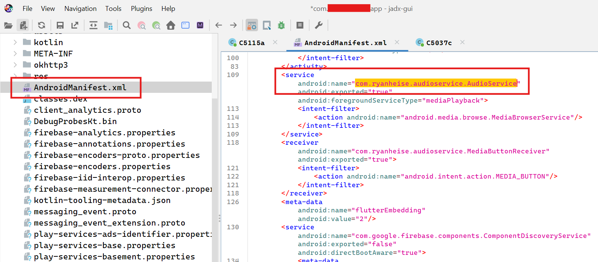
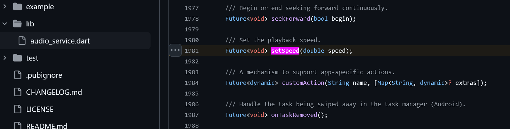
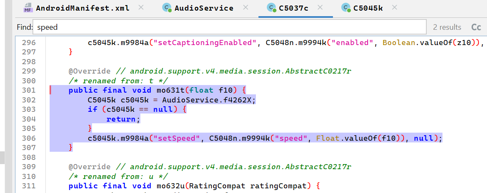
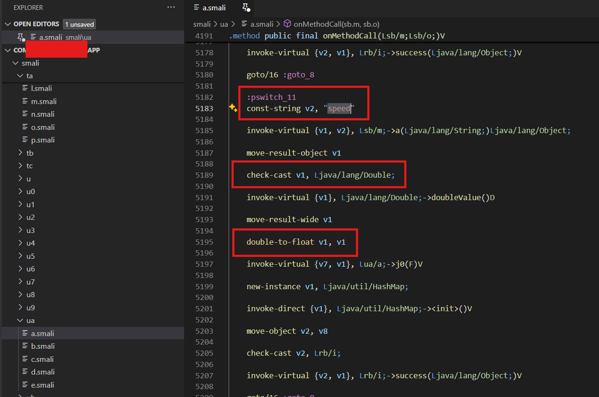

I love listening to podcasts, and news in general. For a couple of years, I've been subscribed to a somewhat-niche (but really high quality) Italian weekly magazine. I like their Android application, and I use its Text To Speech functionality, but there's a big problem with that: it's impossible to increase the audio reproduction speed.

I usually listen to articles while doing something else, such as washing the dishes, or commuting to the office. This means I only have a fixed amount of time for this activity. Because of the time restriction, **I like to cram as much content as possible in my daily listening**. I also get bored very quickly when someone speaks slowly (sorry, I'm engineered like this!). That's exactly why **I set the speed to 2x** for most of the podcasts I'm listening to. Being unable to do the same with the magazine's articles really bothered me.

I had to find a solution to the abysmal slowness of the TTS. I read online that I could use some exotic app from the Play Store, I tried to find such apps, but nothing worked as intended. A friend suggested using a famous Android automation app, but after quickly checking the official website, I realized increasing audio speed is not supported. I don't know if that is even possible on an unrooted device, and **rooting the phone was out of the question**, as some of the apps I'm regularly using (including my bank's) need an unrooted device.

> 💡Keep in mind, I'm definitely not an Android expert, so maybe there was a better way to achieve my goal. If you think so, feel free to contact me! I'd be glad to learn something new.

At that point, the only thing that came to my mind was **modifying the app's bytecode** to somehow increase the reproduction speed. It was Saturday evening, and I had nothing to do, so I thought it was the right time to go down the rabbit hole, if only a little. Broadly speaking, I thought the modification would require the following steps:

1. **decompile** the application
2. **modify** the application's byte code to increase audio reproduction speed
3. **repackage** the app and install it on my android device

Before this small project, I knew nothing of Android decompiling / reverse engineering, I only had a brief experience with reverse engineering GBA roms, so I chatted with Mistral to get a quick grasp on the matter. The chatbot explained the main concepts and provided me with some useful references, namely [this](https://braincoke.fr/blog/2021/03/android-reverse-engineering-for-beginners-decompiling-and-patching/#using-adb) and [this](https://www.hebunilhanli.com/wonderland/mobile-security/decompile-modify-smali-recompile-and-sign-apk/), which I referenced extensively to reach my goal. Without further ado, let's start with the technical part!

> 💡 I won't cite all the details here, so read those two blog posts if you are interested. From now on, I will just broadly explain the steps I carried out. Skip to the conclusions if you just want to know how it went!

## Drinking from the firehose

While a little outdated, the two blog posts gave me a more specific idea of what to do, along with many general information on Android reverse engineering, and opportunities for in depth analyses: 

1. I'd have to use [jadx](https://github.com/skylot/jadx) to produce a **somewhat** readable Java version of the DEX bytecode. 
2. After inspecting the higher-level code, and finding the part where the speed is set, I'd have to modify its pertaining [Smali](https://paulsec.github.io/posts/android-smali-primer/) code which I previously had to extract from the bytecode contained in classes.dex by using [apktool](https://bitbucket.org/iBotPeaches/apktool/src/master/).
3. Finally, I'd have to repackage the apk using apktool, sign it with [apksigner](https://developer.android.com/tools/apksigner), and install it on my phone using [adb](https://developer.android.com/tools/adb)

That's a lot of information right? It will be easier to just show you the steps.

## Jadx

After downloading Jadx, and the app's APK (I used [APKCombo](https://apkcombo.com/) for that), I used jadx-gui to inspect the resulting Java code and the metadata with it. I found out that the app was built using Flutter and the code was obfuscated. This was bad news, as it would mean harder times finding out exactly what the app was doing (and, most importantly, where the relevant code was). A few minutes later though, I had a morale boost after seeing this promising package in AndroidManifest.xml:



A quick Google search revealed the developers used [a Flutter plugin](https://github.com/ryanheise/audio_service) to play the audio in the background. I inspected the source code and found a nice [setSpeed method](https://github.com/ryanheise/audio_service/blob/2895770aebe915ff0f5998605b4525574ce73f5e/audio_service/lib/audio_service.dart#L1981) in the AudioHandler abstract class, along with other methods:



I searched for "setSpeed" and "speed" in the decompiled Java code, and with a little bit of luck, I found some **interesting bits of obfuscated code:**



I continued inspecting the code for a while (I will spare you of more unintelligible decompiled Java classes, don't worry!), and convinced myself that it was worth trying to fix the value of the second argument of "c504n.m9994k", i.e, to 2.0. It was time to check the Smali code.

> 💡 I was lucky enough they that developers hadn't used any String Obfuscation techniques in the executable (at least for the external libraries), otherwise it would've been almost impossible to reach my goal. I guess it's not really worth it to implement such security measures for the app of a magazine!

## Smali assembly

I used `apktool d -r .\com.xxxxxxxx.app.apk` to extract the Smali code, and opened it in VSCode. Given that there may be some errors/inconsistencies when translating DEX to Java, I decided to search again for "speed" and "setSpeed" in the resulting assembly code and found this:



What this code does, is it calls method `sb.m.a("speed")` getting back a double that is then casted to float. I really liked the *double-to-float*, as it resonated with other playback speed related code I found when inspecting the Java decompile. That code was controlling the maximum and minimum allowed playback speed, and used the same *check-cast of double -> cast to float* mechanism I had just witnessed in the smali. **I was convinced** that if I set a fixed float value for register v1 before the *invoke-virtual* at line 5195, it would become the "standard" value for playback speed. Of course, **this was a (very) wild guess**, but it was worth trying.

I modified the Smali code between the *double-to-float* and the *invoke-virtual*:

```
    double-to-float v1, v1

    const/high16 v1, 0x40000000    # added line, this sets v1 register to 2.0f

    invoke-virtual {v7, v1}, Lua/a;->j0(F)V
```

I was ready to repackage everything and test it on my phone.

## Signing and installing

Below I outline the steps I followed to repackage the app and install it on my device:

- First of all, I used `apktool b -d -f .\com.xxxxxxxx.app\` to repackage the application, 
- Then, I created a keystore to self-sign my app using keytool as such: `keytool -genkey -keystore my-release-key.keystore -alias alias_name -keyalg RSA -keysize 2048 -validity 10000`. 
- I signed the app using apksigner `apksigner sign --ks .\com.xxxxxxxx.app\dist\my-release-key.keystore --v1-signing-enabled true --v2-signing-enabled true .\com.xxxxxxxx.app.apk`.
- Finally, I connected my phone (with usb debug enabled) and installed the apk using `adb install .\com.xxxxxxxx.app.apk`.

## Conclusions

If you made it to this point (or if you skipped to the conclusions), you really are interested in the outcome! Well, **I'm happy to say this worked like a charm!** I can now listen to my articles at double the speed. The modification has already saved me significant time and improved my listening experience. Of course there are some minor downsides (namely, the speed is set to 2x for all the audio played by the app), but those don't bother me at all.

> 💡 You'd have to believe me it worked, since I won't share neither the name of the app, nor proof that the modification worked, since that would make the name of the magazine obvious. Reverse engineering/software modifications are a little bit of a gray-zone in Italy. Mostly, you can do as you please as long as you don't redistribute the software, but I'd rather be safe than sorry.

Now you might ask yourself how long it took to pull off this trick: actually, writing this article took way longer: **I got lucky** and got the app modification working at first try. I couldn't believe it myself, since I'm very used to trial and error at work and in life in general. The most difficult thing was understanding the various CLI tools and navigating some of the more-outdated information. The ROI on my time will be very quick. In fact, I calculated I will break even on my time spent in just about one month. All in all, this was a funny weekend project, I should have done it earlier, but I guess it's better late than never.

Thank you for reading my ramblings, power to the nerds!

---

## References

[Hebun Ilhanli - Decompile, Modify Smali, Recompile and Sign APK](https://www.hebunilhanli.com/wonderland/mobile-security/decompile-modify-smali-recompile-and-sign-apk/)

[Braincoke - Android reverse engineering for beginners - Decompiling and patching](https://braincoke.fr/blog/2021/03/android-reverse-engineering-for-beginners-decompiling-and-patching/)

[skylot - jadx](https://github.com/skylot/jadx)

[iBotPeaches - apktool](https://bitbucket.org/iBotPeaches/apktool/src/master/)

[ryanheise - audio_service](https://github.com/ryanheise/audio_service/tree/minor)