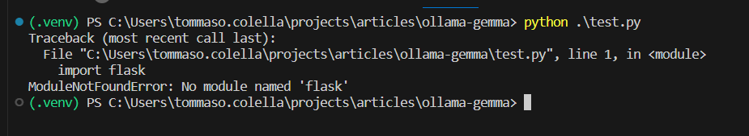

It's impossible to keep up with the rapid developments in the field of LLMs. On Feb 21, Google released a new family of models called Gemma. These models promise top performance for their size. According to the [Gemma technical report](https://goo.gle/GemmaReport), the 7B model outperforms all other open-weight models of the same or even bigger sizes, such as Llama-2 13B.

> 💡According to the technical report accompanying Gemma's announcement, the new models were trained using the same methodologies as Google's top-tier Gemini models

A few days back, I wrote an article on how to use [Ollama](https://ollama.com/) to set up a [Phi-2-based](https://www.microsoft.com/en-us/research/blog/phi-2-the-surprising-power-of-small-language-models/) self-hosted copilot. It was natural for me to provide an update to my previous tutorial to help anyone interested in hands-on trying the new model.

We will use Gemma 2B since it is small enough to run on a typical consumer-level laptop.

After setting up the copilot, we will use it to help us in Python coding and try to compare it with Phi-2.

Let's check some prerequisites, then jump straight to the code!

---

#### Prerequisites

We need to install the same tools as [my previous Phi-2-based tutorial](https://gioleppe.github.io/posts/diy-copilot-phi/), so please install the following:

- [Visual Studio Code](https://code.visualstudio.com/)
- [Continue](https://continue.dev/docs/quickstart) extension for Visual Studio Code
- [WSL](https://learn.microsoft.com/en-us/windows/wsl/install), if you are on Windows

I will use concepts regarding copilots, Rest APIs, and programming in general in the Python coding part, but I will not explain those things in depth.

The copilot was tested on a Dell Latitude 7430 with 16GB of RAM and an Intel i5 1250p. Ollama ran in the WSL-2  environment, limited to 4GB of RAM. Performance may vary depending on your hardware.

---

####  Model Setup

##### Install Ollama and run the model

The steps are the same as in the Phi-2 tutorial, so if you haven't installed Ollama yet (or if you want to update Ollama like me), run:

``````bash
➜  ~ curl -fsSL https://ollama.com/install.sh | sh 
➜  ~ ollama run gemma:2b
``````

I'm omitting the output of each command for brevity. The first command installs Ollama on your OS, and the second one automatically downloads the 2B instruction-tuned model and runs it interactively.

If everything works correctly, you should have an interactive prompt just like this one:


You can chat with the model to confirm it is working, if you want, otherwise continue to the next step.

> 💡Don't close the interactive prompt, otherwise the next steps won't work. If you prefer, you can run the model in the background, or set up a dedicated service.

##### Setup Continue with Gemma

Install Continue from the VS Code extension marketplace, then open the settings from the extension's icon in VS Code to configure the Ollama provider.

Assuming you are running Ollama on localhost, port 11434, modify the configuration file this way:

```json
    {
      "model": "gemma:2b",
      "title": "Ollama-Gemma",
      "completionOptions": {},
      "apiBase": "localhost:11434",
      "provider": "ollama"
    }
```

Now we can select the model from the dropdown in the left of the UI, and start testing the copilot.

### Testing the copilot

We are going to test the copilot the same way we did with the Phi-based one. We will also use the same prompts. 

We create an empty test.py file, then we use the "ctrl+shift+L" shortcut, to open the Quick Edit menu.

We provide the same prompt as we did with Phi-2: *"write a python app with a framework of your choice that accepts GET requests on a endpoint and answers back with a list of Users. The Users must be stored in a local data structure, avoid adding database related code"*:


Here is the generated code:

```python
import flask
import json

app = flask. Flask(__name__)

# Define a list of users
users = []

@app.route("/")
def index():
  return json.dumps(users)

if __name__ == "__main__":
    app.run(debug=True)
```

It is pretty close to what Phi-2 came up with. Here, Gemma preferred to use Python's standard library in place of Flask's JSON implementation to serialize the data. 

Let's try the terminal debug feature with Gemma. If we run the application, we are going to get an error (we are clearly missing the Flask module):



We can use "ctrl+shift+R" to debug our terminal's output with Continue and Gemma:


Gemma identified the problem and gave us a longer explanation than Phi's. This might be better or worse depending on the task we are carrying out and personal preference. For now, it's a close match between the two small-sized models.

After installing the Flask module, and manually adding some data to the preceding code we can run again our test app, and confirm it is working as intended:

```powershell
PS C:\Users\tommaso.colella\projects\articles\ollama-gemma> curl http://127.0.0.1:5000                                        
[{"age": 23, "username": "billgates"}, {"age": 29, "username": "stevejobs"}]
```

Now we are going to ask Gemma a simple CRUD, so we highlight the code, press "ctrl+shift+L" and ask Continue the following prompt (which we already used with Phi-2) *"can you please add endpoints to add users, delete users, and get a user by its index in the list?"*


Gemma gave back the following code:

```python
import flask
import json

app = flask.Flask(__name__)

# Define a list of users
users = [{"age": 23, "username": "billgates"},
         {"age": 29, "username": "stevejobs"}]

# Add a new user
@app.route("/add_user", methods=["POST"])
def add_user():
    data = flask.request.get_json()
    users.append(data)
    return json.dumps(users)

# Delete a user by its index
@app.route("/delete_user/<int:index>")
def delete_user(index):
    users.pop(index)
    return json.dumps(users)

# Get a user by its index
@app.route("/get_user/<int:index>")
def get_user(index):
    return json.dumps(users[index])
if __name__ == "__main__":
    app.run(debug=True)
```

Gemma correctly interpreted my requirements, where Phi-2 made a couple of small errors: it didn't include the *\_\_main\_\_* entry point and got wrong the "delete-by-index" part. That said, Phi-2 included some limited error-related code in responses, which Gemma didn't.

Overall, I think Gemma performed slightly better in this task, but these tests are by no means conclusive and are limited by their own narrow scope.

### Conclusions

The Gemma model family, especially its smaller version Gemma 2B, is a very welcome addition to the world of LLMs (or, SLMs, as these models are often called). The openness of this model (and its cousin Phi-2) makes it very easy for researchers and developers to experiment with them. 

Overall I'm happy with the performance Gemma 2B demonstrated in code completion tasks. 2024 is really starting with a bang, and I'm quite sure we will see a lot more SLMs in the near future.

Thank you for coming this far, power to the nerds!

### References

[Gemma: Google introduces new state-of-the-art open models (blog.google)](https://blog.google/technology/developers/gemma-open-models/)

[Gemma Technical Report](https://goo.gle/GemmaReport)

[Phi-2: The surprising power of small language models - Microsoft Research](https://www.microsoft.com/en-us/research/blog/phi-2-the-surprising-power-of-small-language-models/)

[Ollama](https://ollama.com/)