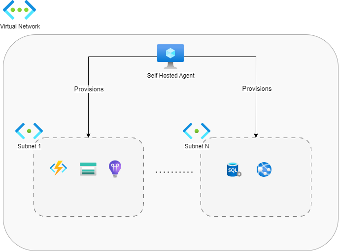
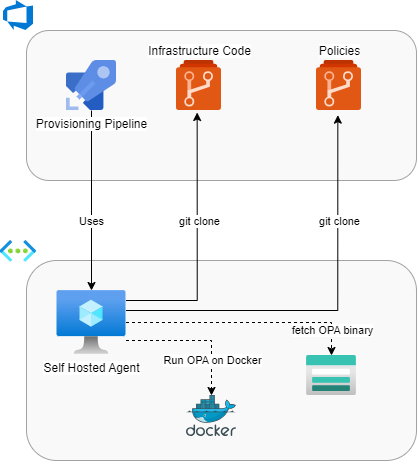
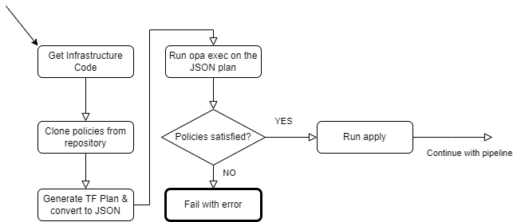

### Enforcing OPA policies with Terraform / OpenTofu in network-isolated Azure VNet - Part 1

Recently, we had a couple of naming-related incidents at work. We respect certain naming conventions, but sometimes errors slip into our Terraform infrastructure's code, and remediation may be costly. 

I had to find a way to simplify resource naming policy enforcement: at first, I thought about using Git Hooks (with a custom HCL parser) or local linters. Both of these approaches came with downsides that would make it unpractical to employ them on multiple repositories: first of all, the necessity to set up hooks or linter configurations in each repo. 

That's when I discovered [Open Policy Agent](https://www.openpolicyagent.org/) (OPA). Integrating OPA into our CI-CD and centralizing shared policies in an Azure Repository would make enforcing trivial. I decided the approach was worth trying and drafted an adoption plan.

The main complication in our setup lies in the network architecture: our resources are network-isolated, so we have to use dedicated Azure Pipelines Agents to provision our infrastructure.

Read this two-article series to see how OPA integrates with Azure DevOps and a network-isolated self-hosted pipeline agent. I will start by quickly going over OPA.

---

#### OPA and Policy as Code

OPA is an open-source, vendor-agnostic policy engine. It is a CNCF graduate project and can be adapted to work in many different use cases and situations: in particular, it can be run both as a CLI tool or as a REST server. 

OPA lets you define policies with a specialized domain-specific language called Rego. You can test JSON structured data describing your domain against these policies, assessing compliance, and providing actionable messages in case of violation.

> 💡I know there are a couple of alternatives to OPA, first of all, the Azure Policy service, but I wanted to be as vendor-agnostic as possible, and I always prefer open-source tools such as OPA when they are available. You can employ OPA and Rego on numerous domains, even other than Infrastructure as Code. There's also a good Rego [extension](https://marketplace.visualstudio.com/items?itemName=tsandall.opa) for writing policies in Visual Studio Code by one of the authors of OPA, Torin Sandall, and a brand new Rego [linter](https://github.com/StyraInc/regal) made by Styra, the company maintaining OPA.

The Rego language is an example of Policy as Code: you write policies in a regular language that is unambiguous and easy to enforce automatically, using tools such as OPA. In my opinion, Policy as Code will bring a lot of value to organizations that have already invested in IaC and DevOps practices in general: automating policy compliance assessment across a wide variety of domains (in a vendor-agnostic way) will eventually help those organizations succeed, and I could imagine "PolicyOps" teams in a not-too-far-future.

The following is a simple example of a Rego policy in which we test if a user is old enough. In the affirmative case, we allow the action. We also allow the action if it comes from a user called Ada. 

```python
package old_enough

import rego.v1

# By default our user is not old enough, and not allowed
default allow := false

default user_is_old_enough := false

# Allow if the user is old enough
allow if user_is_old_enough

# OR allow if the user is called Ada
allow if {
	input.user == "Ada"
}

# user_is_old_enough is true if the user we input is in our data, and its age is >= 18
user_is_old_enough if {
	data.users[input.user] > 18
}
```

We also create a policy_data.json with a list of users and an input.json file with the user we evaluate our policies against. In our small example, the files are as follows:

```json
# input.json
{
    "user": "Hedy"
}

# policy_data.json
{
    "users": {
        "Hedy": 42,
        "Ada": 11
    }
}
```

So, we are checking if Hedy is old enough by querying the *old_enough* policy. We pass OPA her name and a list of policy-associated users as input.

To do this, we can use the opa eval command:

```bash
➜  opa eval -i input.json -d not_old_enough.rego -d policy_data.json "data.old_enough"
```

Which produces the following output:

```json
{
  "result": [
    {
      "expressions": [
        {
          "value": {
            "allow": true,
            "user_is_old_enough": true
          },
          "text": "data.old_enough",
          "location": {
            "row": 1,
            "col": 1
          }
        }
      ]
    }
  ]
}
```

Indeed, Hedy is old enough, so she is allowed as well. 

Further exploration of Rego and OPA is outside the scope of this article. You can check the [official documentation](https://www.openpolicyagent.org/docs/latest/) if you are interested in learning more. It suffices to say that we will use the opa exec command instead of opa eval because it is the intended way to run OPA in [one shot](https://www.openpolicyagent.org/docs/latest/cli/#synopsis-6). 

Now, let's jump to our Azure DevOps example! 

---

#### **OPA usage over network-isolated infrastructure** 

Let's have a quick look at our deployed infrastructure: 



Let's have a quick look at our deployed infrastructure: 
In this slightly simplified version of the infrastructure I'm dealing with at work, we have a network-isolated Virtual Network, which comprises a series of subnets that may communicate with each other. 

The Virtual Network has a dedicated self-hosted Azure Pipelines Agent used to deploy infrastructure over the network-isolated part of the Azure Cloud. The agent is inside a subnet as well. I didn't represent it in the image for simplicity.

> 💡 We are dealing with a high-security environment – that's why we have a dedicated Azure Pipelines agent for our isolated virtual network. Without it, we would have no visibility into our services: it would be impossible to perform most operations on them, including deployments.

We want to store our policies where our agents can easily access them. We are going to use Azure DevOps for this:



There is a reason I drew dotted lines towards Docker and the Azure Storage Account: we can either store the OPA binary into a purposely-made storage account or run a Docker image to use the CLI tool. I left out the possibility of downloading the binary from Styra's website on purpose: if we are allowed access to the public Internet, the docker image is more ergonomic. We are already using Docker on other steps of our Azure Pipeline, so we chose to continue doing so. 

> 💡 In most cases, this kind of choice depends on the architectural requirements of the infrastructure (which may comprise strict security requirements). Some organizations may restrict access to public docker registries, so the storage account method should be the most secure.

The following flowchart diagram describes the steps of our OPA-augmented provisioning pipeline: 



---

#### Preparing a Terraform plan to test our policy against

Now that we have a clear path, it's time to write the policies. We will start by using this simple Terraform code that creates some resources. 

```terraform
#Azure resource group 
resource "azurerm_resource_group" "rg" {
  name     = var.rg_name
  location = var.location
}

#Azure storage account
resource "azurerm_storage_account" "sa" {
  name                     = var.sa_name
  resource_group_name      = azurerm_resource_group.rg.name
  location                 = azurerm_resource_group.rg.location
  account_tier             = "Standard"
  account_replication_type = "LRS"
}

#Azure app service plan
resource "azurerm_service_plan" "sp" {
  sku_name            = "Y1"
  location            = azurerm_resource_group.rg.location
  name                = var.app_service_plan_name
  resource_group_name = azurerm_resource_group.rg.name
  os_type             = "Linux"
}

resource "azurerm_linux_function_app" "fap" {
  for_each                   = var.fap_names
  name                       = each.key
  location                   = azurerm_resource_group.rg.location
  resource_group_name        = azurerm_resource_group.rg.name
  service_plan_id            = azurerm_service_plan.sp.id
  storage_account_name       = azurerm_storage_account.sa.name
  storage_account_access_key = azurerm_storage_account.sa.primary_access_key

  site_config {
  }
}
```

We are mainly interested in the Function Apps provisioned by the *azurerm_linux_function_app* resource. After initializing Terraform, we can use the `terraform plan --out=functions.tfplan` command to generate the binary execution plan, and then we can transform it to JSON by using `terraform show -json .\functions.tfplan > functions.json`. We are ready to write a simple naming convention policy and employ it in our plan.

> 💡 I'm referring to Terraform since that is what I'm using at work, but the steps are 100% compatible with [OpenTofu](https://opentofu.org/), and I highly recommend you check out the project. I'm using OpenTofu in place of Terraform for all my private stuff.

---

#### **Writing a naming convention Policy for Function Apps**

Having decided how to run our policy evaluation, we can proceed by writing a naming convention policy. I will start with a simple one. The plan is to grow the scope of the policies as I get more confidence with the Rego language.

I decided to start with a simple naming convention rule that applies to Function Apps:

- The name must always start with "fap-" which stands for Function App,
- The name must always contain the three-letter abbreviation of the specific project stream we are considering. For the sake of this example, we will go with "-prj-"

After watching this [tutorial on integrating Terraform and OPA](https://www.youtube.com/watch?v=wfhU72d1qqw), I decided to use some of the proposed utility functions, which you can find in the [repo](https://github.com/ned1313/learning-opa-and-terraform/blob/main/4-running-opa-exec/policies/terraform_functions.rego) accompanying the video. In particular, I'm using the *get_resources_by_type* utility function to filter out the resources in the Terraform plan for further analysis:

```
package terraform.plan_functions

import rego.v1

# Get resources by type
get_resources_by_type(type, resources) = filtered_resources {
    filtered_resources := [resource | resource := resources[_]; resource.type = type]
}
```

I placed the helper functions in the *terraform_functions.rego* file.

> 💡 A keen eye should spot a minor difference compared to the code in the repo: I've changed the "*import future.keywords*" statement with *import rego.v1*. This by purpose: according to the [official documentation](https://www.openpolicyagent.org/docs/latest/policy-language/#future-keywords) using *import rego.v1* will ensure keyword compatibility with OPA 1.0 when it releases, thus future-proofing our policies. It's also good to spread best practices such as this one.

Now that we have some helper functions, we can create another file,  *naming_policies.rego*:

```
package general.production

import rego.v1

import data.general.naming_conventions
import data.general.plan_functions
import input.resource_changes # (1)

# Check to see if Function App is using the correct naming convention
linux_faps := plan_functions.get_resources_by_type("azurerm_linux_function_app", resource_changes) # (2)

check_fap_naming_convention(fap) if {
	name := fap.change.after.name
	startswith(name, "fap-")
	contains(name, "-prj-")
} # (3)

incorrect_naming_convention(resource_checks) = resources if {
	resources := [resource |
		resource := resource_checks[_]
		not check_fap_naming_convention(resource)
	] (4)
}

deny contains msg if {
	resources := incorrect_naming_convention(linux_faps)
	resources != []
	
	msg := sprintf("The following function app violates the naming convention: %s", [resources[_].address])
} (5)
```

I'll quickly go over the code: we start by importing the *resource_changes* object from our JSON-formatted Terraform plan (1) that we pass as input, and then we extract all Linux-based function apps by using the *get_resources_by_type* helper function (2). After that, we define a *check_fap_naming_convention* helper function (3) and use it in a comprehension inside the *incorrect_naming_convention* rule (4). The comprehension evaluates to the filtered array of resources which are not following our naming convention. Finally, we define a *deny* rule that generates the set of error messages, in case some of our Function Apps violate the naming convention (5). Note that the message includes the Terraform address of the resource (e.g. *azurerm_linux_function_app.my_fap*) to locate it in our Terraform code.

Don't worry if the code feels slightly difficult: declarative languages may seem daunting at first, but in the end, it's just data manipulation. I'm getting used to the Rego language, and I'm pretty sure my code is still not idiomatic.

I placed all the rego files inside the *policies* folder. I will pass its path as a bundle to the OPA CLI. Now it's time to test our policy by running opa exec locally.

---

#### Running the policy locally

If you've been following along, you should already have a *functions.json* plan file on which we can try to enforce our policies. In my case, I've generated a plan by passing the following value to the *fap_names* variable:

```
fap_names = [
  "fap-prj-one",
  "fap-bad-two",
  "bad-prj-three"
]
```

Functions two and three would violate the naming convention. Let's see our policy bundle in action.

Running the `opa exec --bundle .\general_policies\ --decision general/production/deny .\functions.json` command produces the following output:

```json
{
  "result": [
    {
      "path": ".\\functions.json",
      "result": [
        "The following function app violates the naming convention: azurerm_linux_function_app.fap[\"bad-prj-three\"]",
        "The following function app violates the naming convention: azurerm_linux_function_app.fap[\"fap-bad-two\"]"
      ]
    }
  ]
}
```

The policy works! We still have to integrate it with an Azure DevOps pipeline running on a self-hosted agent. I will do that in the second part of the article, so stay tuned.

Thank you for coming this far. Power to the nerds!