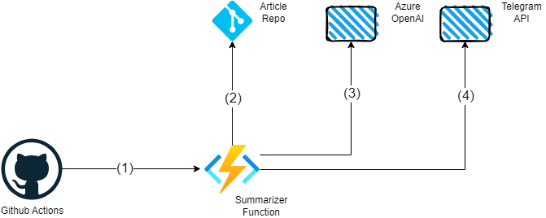
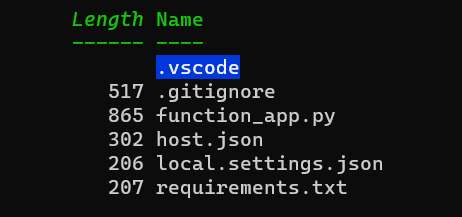
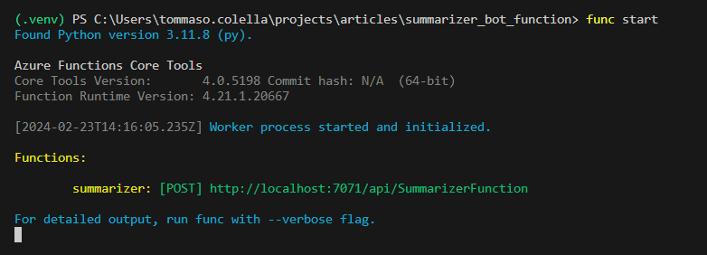
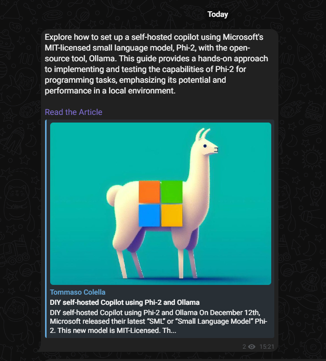
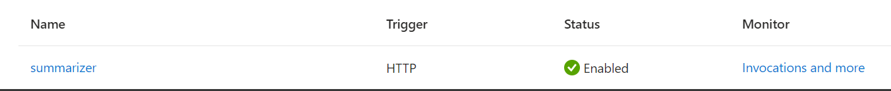
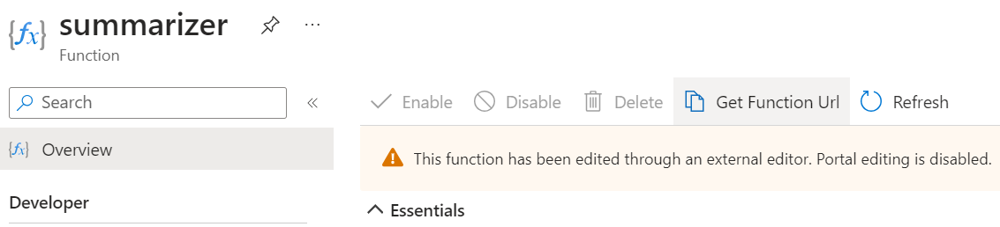
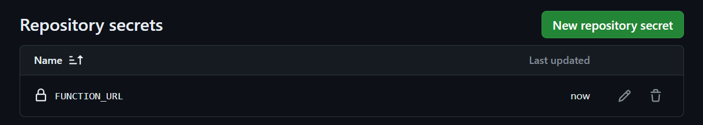
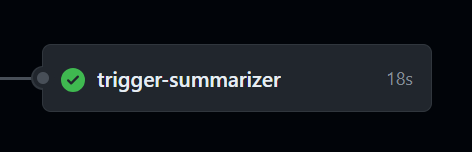

A friend asked me to create a Telegram channel to cross-post my articles onto (I did! You can find it [here](https://t.me/tomstechcorner)). The idea seemed nice, but I didn't want to bother with writing a small summary for each article every time, and most of all, forgetful as I am, I would absolutely forget to post to the channel.

I only had one choice: automate everything using GitHub Actions, Azure Function Apps, and Azure OpenAI, trying to have fun and learn something new in the process.

Let's jump straight into the design phase!

---

### Architecture

The architecture of my solution is quite simple here. 

The ingredients are the following:

1. A Github Action that triggers when I push a new article on my personal blog
2. An LLM or similar model to summarise my article. We'll be using GPT-4 deployed over Azure OpenAI
3. An Azure Function to quickly glue the deployed LLM and the Telegram API with GitHub Actions

Here's a graphical depiction of the REST calls involved:



The Github Action calls the Azure Function **(1)**, which retrieves the article's raw markdown from my GitHub repo **(2)**. The text is passed to the LLM, which summarizes it **(3)**, and the summary is finally sent to the Telegram API **(4)**.

I will start by refining the existing YAML workflow that builds my blog. After that, I'm going to code the integration function.

### Github Action

I prefer convention over configuration, so I set myself to only trigger the function app whenever I commit something with a commit message starting with "article:" in a sort of [Conventional-Commits-like](https://www.conventionalcommits.org/en/v1.0.0/) style. I also provide the name of the folder holding the article so I can pass it to the Azure Function later. 

> 💡Please note I used a bottom-up approach, starting from the GitHub Action, because I already had made up a plan. The integration only needs a small amount of data to transit (just the article's folder name), so it was easier for me to reason this way. 

I quickly asked GPT-4 to create a Github Action for me, and it came up with some reasonable code, which I modified to obtain the following Job:

```yaml
  trigger-summarizer:
    runs-on: ubuntu-latest
    if: startsWith(github.event.head_commit.message, 'article:')
    needs: deploy
    steps:
      - name: Call Summarizer
        env:
            FUNCTION_URL: ${{ secrets.LOGIC_APP_URL }}
        run: |
          COMMIT_MESSAGE="${{ github.event.head_commit.message }}"
          ARTICLE_NAME=$(echo $COMMIT_MESSAGE | awk '{print $2}')
          curl -X POST  $FUNCTION_URL \
            -H "Content-Type: application/json" \
            --data "{\"articleName\": \"$ARTICLE_NAME\"}"
```

As you can see, I check if the commit message starts with "article:" and then I get the second word of the message using [AWK](https://www.geeksforgeeks.org/awk-command-unixlinux-examples/). Finally, I make a POST call to the Azure Function using curl, passing the article folder's name to it. We will add the *FUNCTION_URL* secret later after deploying our Azure Function, so don't worry about that now.

I added the Job to my Workflow, which builds my Hugo-based blog. Find the code [here](https://github.com/gioleppe/gioleppe.github.io/blob/main/.github/workflows/gh-pages.yml) to check how the Job integrates with the preexisting Workflow logic.

Now, let's develop our Azure Function!

### Azure Function

I'm jumping straight to the Azure Function, not showing anything related to the Azure OpenAI service. This is because I already have an article that explains how to deploy Azure OpenAI. Find it [here](https://gioleppe.github.io/posts/azure-openai-service-opentofu/) if you are interested. 

> 💡 Be sure to correctly configure your GPT-4 deployment to avoid any problems with throttling!

We are using the V2 Python programming model for Azure Functions. It is way better than the V1 model in that it lets you define triggers and bindings in line, using Python decorators instead of a separate *function.json* file, and makes for a more ergonomic experience.

Check [this quickstart](https://learn.microsoft.com/en-us/azure/azure-functions/create-first-function-cli-python?pivots=python-mode-decorators&tabs=windows%2Cbash%2Cazure-cli) and install Azure Functions Core Tools if you want to follow along.

Let's follow the suggestions of the tutorial:

```bash
mkdir summarizer_bot_function
cd .\summarizer_bot_function\
func init --model V2 --python
func new --name SummarizerFunction --template "HTTP trigger" --authlevel "function"
```

At this point, you should have a folder like this:



We still lack some libraries we need, so run the following command to install some missing libraries ([requests](https://pypi.org/project/requests/) and [openai](https://pypi.org/project/openai/)) and record the libraries in requirements.txt:

```bash
pip install requests openai
pip freeze > requirements.txt
```

I'm avoiding it for brevity, but consider using a [Python venv ](https://docs.python.org/3.11/library/venv.html)to avoid library problems with future projects.


Now, we can launch Visual Studio Code with `code .` (provided we are still in the same terminal directory) and start developing our Function. Replace the code in function_app.py so that it resembles the following (code is autopep8-formatted):

```python
import azure.functions as func
import logging
import os
from openai import AzureOpenAI
import requests

azure_endpoint = os.getenv('AZURE_OPENAI_ENDPOINT')
azure_key = os.getenv('AZURE_OPENAI_KEY')
telegram_bot_token = os.getenv('TELEGRAM_BOT_TOKEN')
telegram_channel_id = os.getenv('TELEGRAM_CHANNEL_ID')

client = AzureOpenAI(
    azure_endpoint=azure_endpoint,
    api_key=azure_key,
    api_version="2023-05-15"
)

app = func.FunctionApp()


@app.route(route="SummarizerFunction", auth_level=func.AuthLevel.FUNCTION, methods=["POST"])
def summarizer(req: func.HttpRequest) -> func.HttpResponse:
    logging.info('Python HTTP trigger function processed a request.')

    # deserialize article name from request body
    req_body = req.get_json()
    article_name = req_body.get('articleName')

    # retrieve article raw markdown content from GitHub
    raw_md_content = requests.get(
        f"https://github.com/gioleppe/gioleppe.github.io/blob/main/content/posts/{article_name}/index.md").text

    response = client.chat.completions.create(
        model="gpt4_turbo",  # model = "deployment_name".
        messages=[
            {"role": "system", "content": "You are a skilled copywriter. You must summarize the following article in 50 words, the summary will be used as short intro to the linked article in a Telegram channel."},
            {"role": "user", "content": raw_md_content}
        ]
    )

    # initialize the raw string markdown content
    telegram_message_text = f"{response.choices[0].message.content}\n\n[Read the Article](https://gioleppe.github.io/posts/{article_name}/)"

    # post message on telegram channel in markdown format
    telegram_response = requests.post(f"https://api.telegram.org/bot{telegram_bot_token}/sendMessage", data={
        "chat_id": telegram_channel_id, "text": telegram_message_text, "parse_mode": "Markdown"})

    # req_body = req.get_json()

    return func.HttpResponse(f"Telegram responded with: {telegram_response}", status_code=telegram_response.status_code)
```

To make this work, you will have to set the following environmental variables: 

- **AZURE_OPENAI_ENDPOINT**: the endpoint of our Azure OpenAI Service
- **AZURE_OPENAI_KEY**: the key of our Azure OpenAI Service
- **TELEGRAM_BOT_TOKEN**: the token for the telegram bot that posts to our channel
- **TELEGRAM_CHANNEL_ID**: the ID of the channel we want to post to

> 💡To post on the Telegram channel, we need a bot that has enough permission to post on that specific channel. After creating the channel, check the walkthrough [here](https://core.telegram.org/bots/tutorial#obtain-your-bot-token) to obtain a token. Finally, add your bot to the channel. To get the ID of your channel for usage in the code above, follow the steps outlined [here](https://gist.github.com/mraaroncruz/e76d19f7d61d59419002db54030ebe35).

Assuming you've set all the parameters above, we can test our Azure Function by running `func start`:



As you can see, the Azure Function is waiting for our input. You can either use curl like me or a graphical tool such as [Insomnia](https://insomnia.rest/) to make the request:

```
PS C:\Users\tommaso.colella\projects\articles\summarizer_bot_function> curl -X POST http://localhost:7071/api/SummarizerFunction -H 'Content-Type: application/json' -d '{"articleName" : "diy-copilot-phi"}'
Telegram responded with: <Response [200]>
```

If we check our Telegram channel, we can see a freshly made post:



It worked perfectly! The summary is how I wanted it to be. Now, we have to deploy our Function App to Azure. Then, we can test our deployment by committing this new post on Git Hub! 

### Deploying and testing the Function App

First, provision a new serverless Function App on your Azure subscription. You can follow the instructions [here](https://learn.microsoft.com/en-us/azure/azure-functions/scripts/functions-cli-create-serverless) to do it with the Azure CLI or use the Azure Portal.

Note the name of your Function App. In my case, it is called *summarizer-bot-fap*. Now, we can use the Azure Functions Core Tools to deploy our Function App as follows:

```
func azure functionapp publish
```

> 💡Remember to set the App Settings for the Function App on the portal or via the command line. If you need extra security, consider using [Key Vault references](https://learn.microsoft.com/en-us/azure/app-service/app-service-key-vault-references?tabs=azure-cli).

If the publish step worked correctly, you should see the Function in the Functions tab of your Function App:



Now press on the name of your Azure Function, and click the *Get Function Url* button. The URL you just copied contains the default Host key needed to authenticate to your Function App. It is a proper secret, so treat it carefully! We will use it to call our Function from GitHub Actions.



Now head over to GitHub and Add the FUNCTION_URL in the repo settings. If you need help, follow the guide [here](https://docs.github.com/en/actions/security-guides/using-secrets-in-github-actions). In the end, you should see this in your repo's *Secrets and Variables/Action Secrets* section:



And that's it! Time to test the deployment by committing to the repo. We use *"article: diy-copilot-phi test function app"* as a commit message.

After a while, we can see that the trigger summarizer Job is green! If we check the channel, we can see our summary with the relative article link, but I'm sparing you the picture this time!



### **Conclusions**

We have seen how to create a simple summarization solution using Azure OpenAI, Azure Functions, and GitHub Actions. Our solution could be extended as someone might want to check the produced summary before publishing it: this could be achieved by further refining our Telegram integration and introducing a secondary private channel to approve, modify, or reject summaries. I might do that in a future article, but for my actual need, this implementation is enough.

Thank you for coming this far. Power to the nerds!

### References

[Conventional Commits](https://www.conventionalcommits.org/en/v1.0.0/)

[AWK command in Unix/Linux with examples - GeeksforGeeks](https://www.geeksforgeeks.org/awk-command-unixlinux-examples/)

[Deploying AzureOpenAI Service using OpenTofu | Tommaso Colella | SWE (gioleppe.github.io)](https://gioleppe.github.io/posts/azure-openai-service-opentofu/)

[Create a Python function from the command line - Azure Functions | Microsoft Learn](https://learn.microsoft.com/en-us/azure/azure-functions/create-first-function-cli-python?pivots=python-mode-decorators&tabs=windows%2Cbash%2Cazure-cli)

[requests · PyPI](https://pypi.org/project/requests/)

[openai · PyPI](https://pypi.org/project/openai/)

[venv — Creation of virtual environments — Python 3.11.8 documentation](https://docs.python.org/3.11/library/venv.html)

[From BotFather to 'Hello World' (telegram.org)](https://core.telegram.org/bots/tutorial#obtain-your-bot-token)

[Create a serverless function app using the Azure CLI | Microsoft Learn](https://learn.microsoft.com/en-us/azure/azure-functions/scripts/functions-cli-create-serverless)

[Use Key Vault references - Azure App Service | Microsoft Learn](https://learn.microsoft.com/en-us/azure/app-service/app-service-key-vault-references?tabs=azure-cli)

[Using secrets in GitHub Actions - GitHub Docs](https://docs.github.com/en/actions/security-guides/using-secrets-in-github-actions)