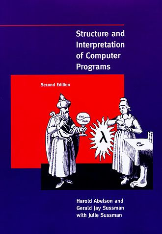
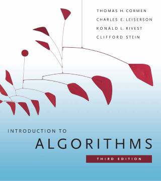
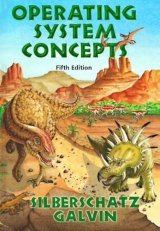

If you're a bookworm like me, you can't resist the fascination of the paper medium. Reading a proper book is a much more relaxing experience than reading on a screen. Some [studies](https://www.ncbi.nlm.nih.gov/pmc/articles/PMC6618184/) also found a correlation between phone usage in bed and increased risk of having poor sleep quality. These are some reasons I've always preferred reading from paper books, especially at nighttime.

Computer Science books are often expensive, and one could always object that paper production has an undeniable carbon footprint. You could go to a public library, which I personally do, and it is always a great idea. That said, some textbooks are perfect for frequent consultation: one would like to have them readily available. 

What to do then? Not all hope is lost: some websites sell dirt-cheap used books about many topics in CS. 

In particular, foundational topics seldom change: network protocols may evolve, and storage may become faster and cheaper. Even then, the concepts behind these things are moving more slowly than the technologies themselves. Older CS books are still great for deepening your knowledge of specific subjects or picking foundational concepts. CS universities try to keep up with the new editions of said books and usually bulk-sell their old textbooks to big second-hand retailers, so it's common to find older editions for a fraction of the price. 

There's also a sense of awe when buying a second-hand book. That book has a story: my copy of "Advanced UNIX Programming" by Marc Rochkind comes from a UK university. Thinking about past generations of students becoming proficient in the subject by reading my very copy is romantic and mind-tickling.

I've collected some websites that you can use to get books at very cheap prices. I've also written some personal recommendations. I'm based in Europe (Italy, to be precise), so shipping times and costs may vary on these websites. Shipping is usually cheap when buying books. As far as I know, the websites I propose are shipping worldwide. You can also leverage the bulk-shipping policies that all these websites propose.

## Used book websites

- [AbeBooks](https://abebooks.com/): it's been around since the mid-90s. I've used it extensively in the past to buy university textbooks. The company is originally from Canada. Some localized versions of the website are conveniently linked at the bottom of the page. Abebooks also provides [BookFinder](https://www.bookfinder.com/), a specialized search engine that helps in more fine-tuned book searches across various catalogs.

- [World of Books](https://wob.com/): Launched in 2005 in the UK, it is the biggest second-hand books retailer in the UK. Their catalog is massive. Sometimes, their books are also sold through AbeBooks. I've used it to buy books on Haskell and Clojure, and my experience has been seamless both times. Don't worry about importation taxes: books [have not been affected by Brexit policy changes](https://www.independentpublishersguild.com/IPG/IPG/Resources/Brexit/Brexit-information.aspx), as far as I know.
- [Better World Books](http://betterworldbooks.com/): I've never used this website, but it is from the United States, so it might be practical to anyone living there. It is very similar to AbeBooks and World of Books.

## Some book recommendations

Here are some books I found particularly useful when studying Computer Science. I've read all of them, except for the Operating Systems one, but I still provided it in the list because it is dirt cheap, and some friends recommended it. In the first draft of this article, I tried to provide links to some copies found on second-hand websites. I quickly realized this was not viable, as some copies had already been sold when finishing the article. Look for yourself and search these books on the websites I provided above.

I'm not including advanced technical books by O'Reilly or Manning in the list since I would like to make this article appealing to a broader generalist audience: there are plenty in the websites' catalogs if you're interested.

### Structure and Interpretations of Computer Programs

By H. Abelson, G. J. Sussman with J. Sussman

Also known as The Wizard Book, this is a cornerstone for Computer Science: it gives a lot of knowledge while teaching you Scheme, a dialect of the Lisp programming language. The book is not easy to read, but it's rewarding. The second edition, from 1996, goes for **as few as 15$**. Given its popularity in the CS community, it is easy to miss a copy. If you are interested in buying it, be sure to check often. In 2022, a Javascript edition was released to keep up with the times.

### Introduction to Algorithms 

By Thomas H. Cormen (Dartmouth College)

This is a must in every CS library. This book explains the most commonly used Data Structures and Algorithms, providing theoretical explanations and pseudo-code implementations. A new edition is out, but the third edition, from 2009, is still perfect for most use cases. The price is not low: this **usually goes for around 30$**, but this book lasts a lifetime and is very hefty. The original third edition, by Cambridge University Press, has a premium hardcover.

### Operating System Concepts

By Silberschatz, Galvin and Gagne

Personally, I haven't read this one. According to many people I talked to, this is one of the best books on Operating Systems available on the market, and it is also **very cheap**. There are a lot of different editions to choose from, and you can easily find some from around 2010 going for **as cheap as 5$.** The cover's leitmotif is dinosaurs, which makes the book extremely cool.

### Computer Networking: A Top-Down Approach

By J.F. Kurose, K.W. Ross

I've studied Computer Networking in this textbook. I found its explanation on many topics enlightening. My copy is from 2009. It cost around 9$ when I bought it in 2017. Now, the sixth edition can be found for **around 6$**. A steal, if you ask me: the value this book brings is immense. The book is updated regularly, and newer editions are available for a slightly higher cost.

### Introduction to Information Retrieval

By C. D. Manning, P. Raghavan, H. Schütze (Stanford University, California)

If you are interested in how search engines work, this book is for you: it gives explanations of the ideas that made Google the colossus of search. The text is clear and concise and makes following the concepts very easy. The book usually can be found for **around 25$**, which is very appealing, given that this is a hardcover edition.

---

### References

[AbeBooks - Wikipedia](https://en.wikipedia.org/wiki/AbeBooks)

[BookFinder.com - Wikipedia](https://en.wikipedia.org/wiki/BookFinder.com)

[World of Books - Wikipedia](https://en.wikipedia.org/wiki/World_of_Books)

[Better World Books - Wikipedia](https://en.wikipedia.org/wiki/Better_World_Books)

[Brexit information (independentpublishersguild.com)](https://www.independentpublishersguild.com/IPG/IPG/Resources/Brexit/Brexit-information.aspx)